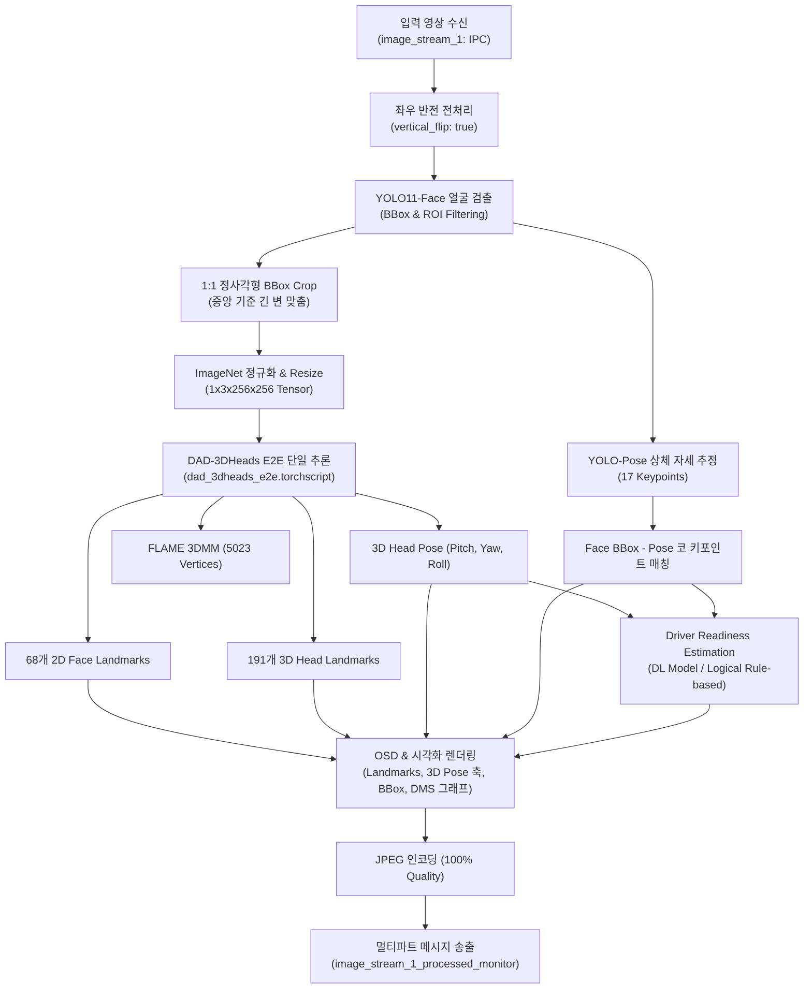

# OSM Monolithic Inference V2 (`osm.monolithic.inference_v2`)

`osm.monolithic.inference_v2`는 단일 컴포넌트 내에서 **얼굴 검출(YOLO Face)**, **End-to-End 3D 얼굴/머리 분석(DAD-3DHeads E2E)**, **상체 자세 추정(YOLO Pose)**, 그리고 **운전자 준비도 추정(Driver Readiness Estimation)**을 통합 수행하는 고성능 추론 파이프라인 컴포넌트입니다.

기존 V1 파이프라인에서 분리되어 있던 2D Face Landmark, 3D Face Landmark, Head Pose Estimator들을 **`dad_3dheads_e2e.torchscript` 단일 통합 모델**로 일원화하여 연산 효율과 3D 포즈 추정 정확도를 대폭 향상시켰습니다.

---

## 1. 파이프라인 아키텍처 (Pipeline Architecture)



---

## 2. 단계별 상세 처리 과정 (Detailed Pipeline Stages)

### Stage 1: 이미지 수신 및 전처리
- **IPC 수신**: `image_stream_1`을 통해 그래버로부터 Raw Image(BGR) 및 메타데이터 JSON을 수신합니다.
- **좌우 반전 (Horizontal Flip)**: JSON 설정의 `"vertical_flip": true` 옵션에 따라 카메라 거울 모드 처리를 수행합니다 (`cv::flip(..., 1)`).

### Stage 2: YOLO Face Detection 및 ROI 필터링
- `yolo11n-face.torchscript` 모델을 활용하여 얼굴 바운딩 박스를 검출합니다.
- 사용자 설정 ROI(`roi: [x1, y1, x2, y2]`) 영역 내에 위치한 유효한 얼굴만을 필터링합니다.

### Stage 3: Center-based 1:1 정사각형 Bounding Box 생성 ([`face_analysis_e2e.cc`](face_analysis_e2e.cc))
- 검출된 BBox의 가로(`width`)와 세로(`height`) 중 **긴 쪽의 길이(`max_side = max(w, h)`)**를 한 변의 길이로 정의합니다.
- BBox의 중심점(`cx`, `cy`)을 그대로 유지하면서 정사각형 영역을 확장합니다:
  $$\text{sq\_x1} = \text{round}\left(cx - \frac{\text{max\_side}}{2}\right), \quad \text{sq\_y1} = \text{round}\left(cy - \frac{\text{max\_side}}{2}\right)$$
- 이미지 경계를 벗어나는 영역은 안전하게 패딩(Zero padding) 처리하여 왜곡 없는 정사각형 얼굴 패치를 추출합니다.

### Stage 4: DAD-3DHeads E2E 모델 추론 ([`face_analysis_e2e.cc`](face_analysis_e2e.cc))
- 추출된 정사각형 패치를 `256 × 256` 해상도로 리사이즈하고, BGR $\to$ RGB 변환 및 ImageNet 표준 정규화(`mean=[0.485, 0.456, 0.406]`, `std=[0.229, 0.224, 0.225]`)를 적용합니다.
- `dad_3dheads_e2e.torchscript` 단일 모델의 Forward를 통해 아래 출력을 한 번에 획득합니다:
  1. **`3dmm_params` `[1, 413]`**: FLAME 3D Morphable Model 파라미터 (Shape 300, Expr 100, Jaw 3, 6D Rotation 6, Trans 3, Scale 1).
  2. **`landmarks_68` `[1, 68, 2]`**: 표준 68개 2D Facial Landmarks (원본 영상 좌표계로 자동 복원).
  3. **`landmarks_191` `[1, 191, 2]`**: 191개 2D/3D Head Landmarks.
  4. **`vertices_3d` `[1, 5023, 3]`**: 3D FLAME Head Mesh 정점 좌표.
  5. **`projected_vertices_2d` `[1, 5023, 2]`**: 2D 투영 정점 좌표.
- **3D Head Pose 계산**:
  - `3dmm_params`의 6D Rotation 벡터로부터 직교 회전 행렬($R_{3\times3}$)을 산출하고, `cv::RQDecomp3x3`을 통해 **Pitch, Yaw, Roll** 오일러 각도를 추출합니다.

### Stage 5: Body Pose Estimation 및 매칭
- `yolo26m-pose.torchscript` 모델을 통해 상체 17개 관절 키포인트를 추론합니다.
- 얼굴 BBox 영역 내에 코(Nose, index 0) 키포인트가 위치하는 포즈를 매칭하여 최적의 운전자 포즈를 결정합니다.

### Stage 6: 운전자 준비도 추정 (Driver Readiness Estimation)
- **딥러닝 기반 (`driver_readiness_estimation`)**:
  - 상체 키포인트 11개 + 머리 오일러 각도 3개의 64프레임 시계열을 입력으로 받아 5개 클래스 예측 Logits 및 Softmax 확률을 산출합니다.
- **논리 규칙 기반 (`driver_readiness_estimation_logical`)**:
  - 기준 정면 각도(`ref_yaw`, `ref_pitch`)와의 오차 및 허용 범위 내 체류 시간($t_{\text{dwell}}$) 기반 가우시안 감쇠 점수($0.0 \sim 1.0$)를 계산합니다.

### Stage 7: 통합 시각화 및 OSD 렌더링
- **출력 해상도 리사이즈**: 데이터포트 설정 해상도(`594 × 1056` 등)에 맞추어 좌표계를 자동 스케일링합니다.
- **렌더링 요소**:
  - 68개 얼굴 랜드마크 (녹색 점) 및 191개 헤드 랜드마크 (마젠타 점, 옵션)
  - 3D Head Pose 축 (코 끝 기준 X-빨강, Y-초록, Z-파랑)
  - 1:1 정사각형 BBox (노란색) 및 검출 BBox (녹색)
  - 상체 스켈레톤 라인 (노란색 선 및 빨간색 관절점)
  - 좌측 하단 Head Pose 각도 박스 (Pitch, Yaw, Roll)
  - 우측 하단 최근 10초간 운전자 준비도 점수 실시간 그래프
  - 상단 일시/타임스탬프 및 실시간 FPS

### Stage 8: JPEG 인코딩 및 멀티파트 전송
- 처리된 영상을 고화질 JPEG로 압축하고 메타데이터 태그와 함께 `image_stream_1_processed_monitor` 포트로 송출합니다.

---

## 3. JSON 설정 명세 (`osm_monolithic_inference_v2.json`)

```json
{
    "rt_cycle_ns": 1000000000,
    "verbose": 1,
    "parameters": {
        "show_info": true,
        "vertical_flip": true,
        "use_image_stream": [1],
        "face_detection": {
            "use": true,
            "visualize": true,
            "use_roi": true,
            "roi": [100, 150, 1040, 1300],
            "roi_visualize": true,
            "model_path": "/home/iae-vc/dev/flame_osm/bin/x86_64/models/yolo11n-face.torchscript",
            "gpu_id": 0,
            "nms": 0.45,
            "padding": [0.3, 0.2]
        },
        "face_analysis_e2e": {
            "use": true,
            "visualize": true,
            "model_path": "/home/iae-vc/dev/flame_osm/bin/x86_64/models/dad_3dheads_e2e.torchscript",
            "gpu_id": 0,
            "vis_landmarks_68": true,
            "vis_landmarks_191": false,
            "vis_head_pose": true,
            "vis_square_box": true,
            "vis_head_mesh": false
        },
        "body_pose_estimation": {
            "use": true,
            "visualize": true,
            "model_path": "/home/iae-vc/dev/flame_osm/bin/x86_64/models/yolo26m-pose.torchscript",
            "gpu_id": 0
        },
        "driver_readiness_estimation": {
            "use": false,
            "visualize": true,
            "model_path": "/home/iae-vc/dev/flame_osm/bin/x86_64/models/iae_dms_251212.torchscript",
            "gpu_id": 1,
            "threshold": 0.5,
            "readiness_low": 0.2,
            "readiness_moderate": 0.5,
            "readiness_high": 1.0
        },
        "driver_readiness_estimation_logical": {
            "use": true,
            "visualize": true,
            "ref_yaw": 41.0,
            "ref_pitch": -130.0,
            "sigma_yaw": 15.0,
            "sigma_pitch": 20.0,
            "t_window": 3.0,
            "readiness_low": 0.2,
            "readiness_moderate": 0.5,
            "readiness_high": 1.0
        }
    },
    "dataport": {
        "status": {
            "transport": "tcp",
            "host": "*",
            "port": 5103,
            "socket_type": "pub",
            "queue_size": 10
        },
        "image_stream_1": {
            "transport": "ipc",
            "socket_type": "sub",
            "queue_size": 10
        },
        "image_stream_1_processed_monitor": {
            "transport": "tcp",
            "host": "100.120.210.70",
            "port": 5203,
            "socket_type": "pub",
            "queue_size": 10,
            "resolution": {
                "width": 594,
                "height": 1056
            }
        }
    }
}
```

---

## 4. 빌드 및 실행

```bash
# 컴포넌트 빌드
make osm_monolithic_inference_v2.comp

# FLAME 플랫폼 실행
./flame --config bin/x86_64/osm_process/osm_monolithic_inference_v2.json
```
